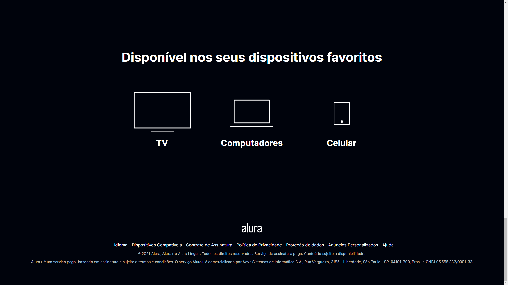

# AluraPlus
Projeto Criado no curso Alura - Praticando HTML e CSS

## Curso 01 - Alura
Projeto para colocar em prática conhecimentos de HTML e CSS

Uso do <strong>Figma</strong> para criar Layout
 
https://www.figma.com/file/autz6QPttyj7enMfIaKQ4s/Alura-Plus---Layout?node-id=0%3A1

## Principais Conhecimentos
<ul>
  <li>Base HTML + Estilização (CSS)</li>
  <li>Uso de variáveis no Style.css</li>
  <li>Utilzação de Classes, Grid e Display Flex</li>
  <li>Posicionamento de Elementos (Alinhamento)</li>
  <li>Pseudo-classes e CSS interativo</li>
</ul>

## Preview do site!

  Tela Inicial
  

  Footer
  

